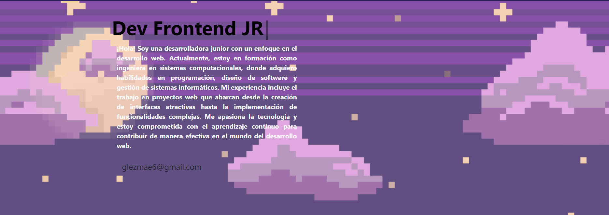
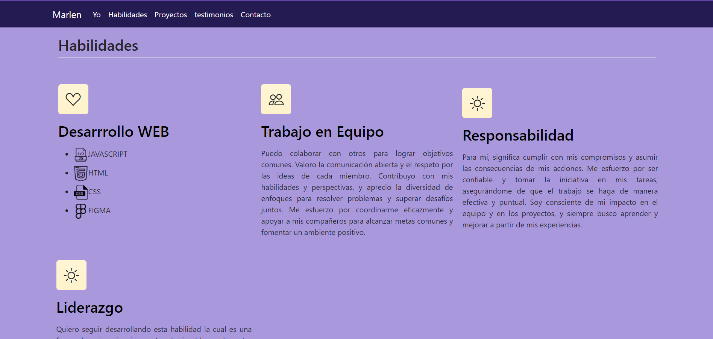
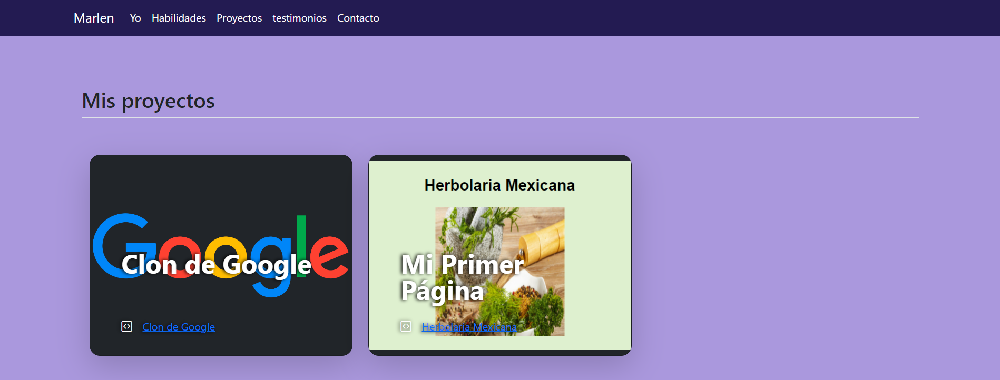
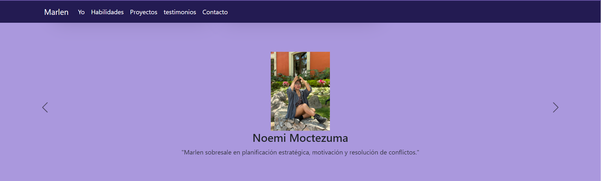

# Mi portafolio de Habilidades TECHNOLOCHICAS PRO 💜

El presente proyecto es un portafolio desarrollado para poner en práctica las habilidades obtenidas dentro del bootcamp de desarrollo frontend de Technolochicas PRO.

Fue desarrollado con HTML, CSS, y JS con el uso de el framework de UI, Bootstrap utilizando además bibliotecas externas.

La página es responsiva(adaptable a diferentes tamaños de pantalla) e inlcuye la presentación de la autora del proyecto.

Proyecto desplegado.
hhttps://mi-portafolio-marlengz.netlify.app
## Secciones de mi sitio

## Tecnologías
* HTML
* CSS
* BOOTSTRAP
* JavaScript
---

Desarrollado con  💜 por [Marlen](https://mi-portafolio-marlengz.netlify.app ) en [TECHNOLOCHICAS PRO](https://tecnolochicas.mx/)
